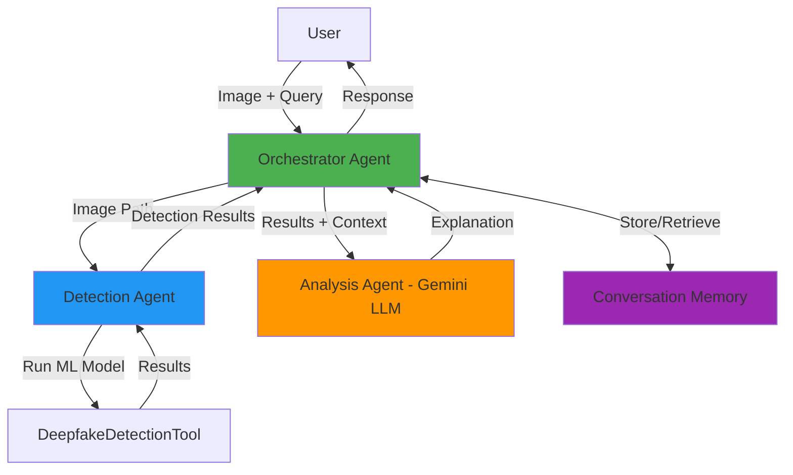

# 🤖 Deepfake Detection Agent System

An intelligent multi-agent system for detecting AI-generated deepfake images, powered by Google Gemini and built for the **Kaggle Agents Intensive Capstone Project**.


## 🎯 Problem Statement

**The Challenge**: The proliferation of AI-generated deepfake images poses serious threats to information integrity, personal privacy, and public trust. Manual detection is time-consuming and requires expertise.

**The Solution**: An AI agent system that not only detects deepfakes but also explains the results in natural language, answers follow-up questions, and maintains conversation context for iterative analysis.

## 🌟 Why Agents?

Traditional deepfake detection tools provide binary outputs without explanation. This **multi-agent system** offers:

1. **🤖 Automated Detection** - ML model analyzes images automatically
2. **💬 Intelligent Explanation** - LLM-powered agent explains results in plain language
3. **❓ Interactive Q&A** - Users can ask follow-up questions about detections
4. **🧠 Context Awareness** - Conversation memory enables multi-turn interactions
5. **📊 Observability** - Full logging and tracing for transparency

## 🏗️ Architecture

### Multi-Agent System Design



## 📁 Project Structure

```bash
Agent/
├── 🐍 agent_system.py          # Multi-agent orchestrator (CLI)
├── 🌐 app.py                   # Flask web application
├── 🔍 deepfake_detector.py     # ML model wrapper
├── ⚙️ config.py                # Configuration management
├── 📋 requirements.txt         # Python dependencies
├── 🔒 .env.example             # Environment template
├── 📖 README.md                # This file
├── 📁 static/                 # Web app assets
│   ├── 🎨 css/style.css       # Styling
│   ├── ⚡ js/script.js        # Frontend logic
│   └── 🖼️ images/            # UI assets
├── 📁 templates/              # Flask templates
│   └── 🏠 index.html          # Main interface
```
